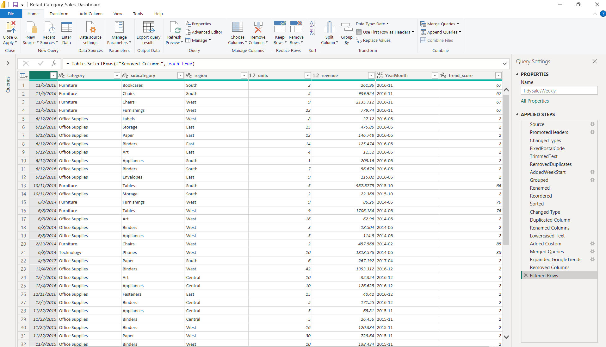
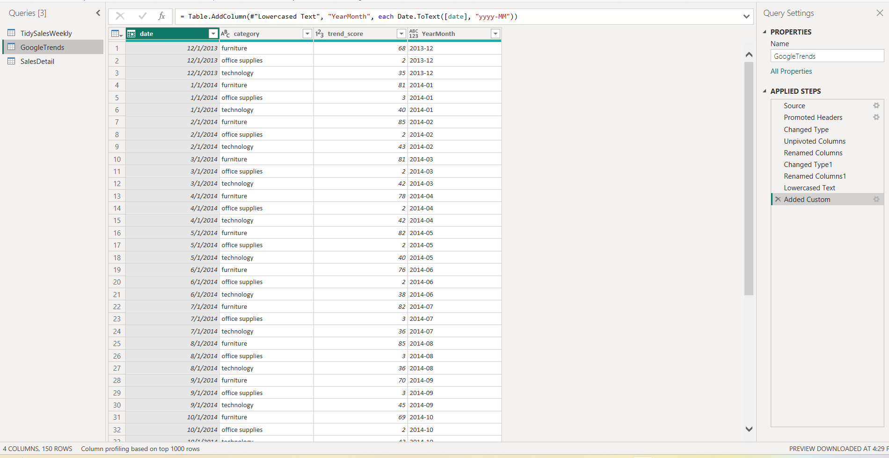

# Retail Category Sales Dashboard & Demand Forecast

A retail analytics project that combines transactional sales data with Google
Trends search interest to analyze category, regional, and seasonal
performance — and to forecast near-term demand.

## Project Overview

This project takes the Superstore sales dataset (2013–2017) and enriches it
with Google Trends search-interest data to answer three business questions:

1. Which categories and regions are driving revenue growth?
2. How seasonal is demand, and when should inventory be positioned?
3. What does the next quarter look like, and how much should we trust it?

The work is organized into three stages:

| Stage | Description | Output |
|---|---|---|
| 1. Data Preparation | Clean and merge Superstore sales with Google Trends in Power Query | Tidy analytical dataset |
| 2. Dashboard | Build an interactive Power BI report on the merged dataset | `Retail_Category_Sales_Dashboard.pbix` |
| 3. Forecast & Brief | Model monthly revenue with Holt-Winters and summarize findings | `sales_forecast.ipynb`, marketing brief |

## Repository Contents

| File | Description |
|---|---|
| `Sample_-_Superstore.csv` | Raw transaction-level sales data (source) |
| `google_trends.csv` | Raw monthly Google Trends search interest by category (source) |
| `Retail_Category_Sales_Dashboard.pbix` | Power BI dashboard: revenue by category, subcategory, and region; monthly/YoY trends; seasonality; top and bottom SKUs |
| `retail_category_sales_dashboard_charts.pdf` | Exported view of the dashboard visuals |
| `sales_forecast.ipynb` | Holt-Winters forecasting notebook (monthly revenue) |
| `Sales & Marketing Brief.docx` | Business-facing summary of findings and recommended actions |

## 1. Data Preparation

The Superstore sales dataset was cleaned in Power Query and combined with
Google Trends data to create a single tidy analytical table.

**Final analytical fields:** Date, Category, Subcategory, Region, Units,
Revenue, YearMonth, Trend Score

**Process:**
- Standardized `Order Date` to a proper Date type
- Kept transaction-level detail, aggregating only for analysis/visuals
- Created a `YearMonth` key to align daily sales with monthly Trends data
- Unpivoted Google Trends from wide format (one column per category) to a
  long `Category` + `Trend Score` format
- Standardized category names (e.g., "Office supplies" → "Office Supplies")
- Left-joined Trends onto sales by `YearMonth` + `Category` to preserve every
  sales record, even where no Trends value was available

### Data Quality Log

| Issue | Observation | Resolution |
|---|---|---|
| Transaction-level Superstore data | Multiple rows per order/product | Kept transactional detail, then aggregated for analysis |
| Date format | Order Date imported inconsistently as text/date | Converted to Date type |
| Different time grains | Sales data is daily; Google Trends is monthly | Created `YearMonth` for matching |
| Google Trends wide format | Separate columns for Furniture, Office Supplies, Technology | Unpivoted to `Category` + `Trend Score` |
| Category naming mismatch | "Office supplies" vs. "Office Supplies" | Standardized category names |
| Repeated Trend values | Same monthly value appears on many sales rows | Expected — one monthly score applies to many transactions |
| Missing sales after merge risk | External signal may not exist for every row | Used a left outer join to preserve all sales data |
| Google Trends interpretation | 0–100 index, not raw search volume | Treated as an external interest proxy, not a demand quantity |

### Power Query Output

## 2. Dashboard

The Power BI report (`Retail_Category_Sales_Dashboard.pbix`) is built on the
merged dataset and includes:

- **KPIs:** Total Revenue, Total Units, YoY Revenue %
- **Revenue by Category / Subcategory / Region**
- **Monthly revenue trend** with prior-year comparison
- **Seasonality view** by month across years
- **Revenue vs. Google Trends** to compare sales against search interest
- **Top 5 / Bottom 5 SKUs** by sales
- Slicers for Region, Category, and Date

A static export of the visuals is available in
`retail_category_sales_dashboard_charts.pdf`.

## 3. Forecast

Monthly revenue was modeled using **Holt-Winters Exponential Smoothing**
(additive trend, additive 12-month seasonality) in `sales_forecast.ipynb`.

- **Training period:** Jan 2014 – Sep 2017
- **Hold-out period:** Oct 2017 – Dec 2017
- **Hold-out accuracy:** MAPE 20.64% · RMSE $20,252.62 · MAE $18,700.22

Holt-Winters was chosen because the monthly series shows both a clear trend
and recurring seasonal patterns. A MAPE of ~20.6% indicates moderate
accuracy — reasonable for a retail series with meaningful month-to-month
variation, but not precise enough to use without a buffer. The final model
was refit on the full history to produce a next-quarter forecast.

## Key Findings

- **Technology leads revenue; Office Supplies is growing fastest.**
  Technology generated ~$271.7K in 2017 (≈37% of annual revenue, +20% YoY).
  Office Supplies grew ~34% YoY to ~$246.1K, with rising search interest
  reinforcing the trend.
- **The West is the strongest and still-expanding region**, at ~$250.1K in
  2017 revenue (≈34% of company sales, +33% vs. 2016). Central was
  essentially flat.
- **Demand is highly seasonal**, with ~$280.1K (≈38%) of 2017 revenue
  landing in Q4 — supporting the case for positioning inventory ahead of the
  seasonal peak rather than reacting to it.

Full recommendations and business impact are in the Sales & Marketing Brief.

## How to Reproduce

1. Open `Sample_-_Superstore.csv` and `google_trends.csv` in Power BI /
   Power Query and apply the cleaning steps in [Data Preparation](#1-data-preparation).
2. Open `Retail_Category_Sales_Dashboard.pbix` in Power BI Desktop to explore
   the dashboard, or view `retail_category_sales_dashboard_charts.pdf` for a
   static version.
3. Run `sales_forecast.ipynb` (requires `pandas`, `numpy`, `matplotlib`,
   `statsmodels`, `scikit-learn`) to regenerate the forecast and accuracy
   metrics.
